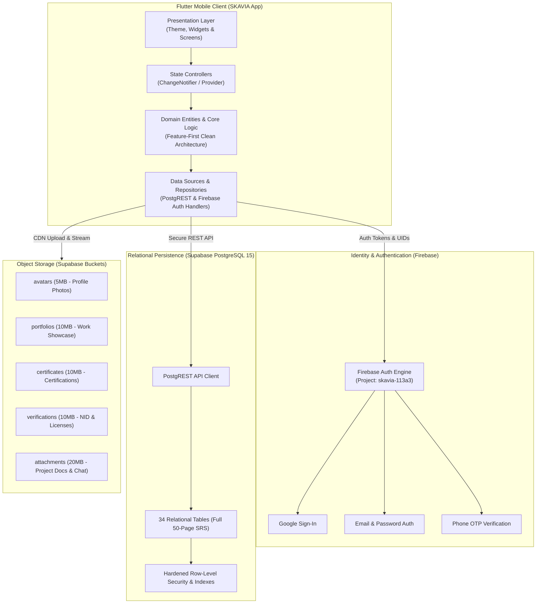

<p align="center">
  
</p>

<h1 align="center">SKAVIA</h1>
<p align="center">
  <strong>Solution-Oriented Service & Workforce Platform</strong><br>
  <em>Enterprise On-Demand Service & Skilled Workforce Ecosystem</em>
</p>

<p align="center">
  
  
  
  
  
  
</p>

---

## 📌 Platform Overview & Engineering State

* **System:** SKAVIA Solution-Oriented Service & Workforce Platform
* **Target Platforms:** Android / iOS / Web (Flutter 3.x)
* **Engineering Paradigm:** Feature-First Domain-Driven Clean Architecture
* **Active Milestone:** **Phase 1 Complete** *(Foundation, Modular Architecture & Dual-Backend Live Integration)*
* **Security Standard:** Row Level Security (RLS) on all 34 relational tables, Firebase Auth token verification, tamper-evident audit logging

---

## 🏗️ System Architecture & Daily Integration Flow



---

## 📋 Lab Milestone: Week 1 Deliverables (Architecture & Dual Backend Setup)

According to the [12-Week Strategic Roadmap](SKAVIA_12_WEEK_PLAN.md), Week 1 focuses on scaffolding the enterprise architecture, establishing the Firebase authentication layer, and deploying the complete Supabase relational database and storage infrastructure.

### 1. Enterprise Architecture Initialization
- Initialized Flutter cross-platform skeleton adhering strictly to **Feature-First Domain-Driven Clean Architecture** (`lib/app`, `lib/core`, `lib/shared`, `lib/data`, `lib/features`).
- Established single-responsibility documentation:
  - [`ARCHITECTURE.md`](ARCHITECTURE.md): Separation of concerns and dependency rules.
  - [`SKAVIA_12_WEEK_PLAN.md`](SKAVIA_12_WEEK_PLAN.md): 12-week MVP roadmap, task distribution, and defense walkthrough.
  - [`ROUTING_AND_FILE_STRUCTURE.md`](ROUTING_AND_FILE_STRUCTURE.md): Application route catalog and navigation mapping.

### 2. Firebase Authentication Integration (100% Configured)
- Connected Firebase project **`skavia-113a3`** with `firebase_core` and `firebase_auth`.
- Integrated `lib/firebase_options.dart` and native `android/app/google-services.json`.
- Extracted and linked Android Keystore **Debug SHA-1** (`40:EF:AD:...`) and **SHA-256** to prevent `ApiException 10` during Google Sign-In and Phone OTP verification.

### 3. Supabase Relational Database Deployment (34 Tables)
- Conducted deep architectural analysis of the **50-page SKAVIA SRS** (Sections 4.4, 4.5 & 4.8).
- Authored and executed [`supabase_schema.sql`](supabase_schema.sql) in Supabase SQL Editor:
  - **Full Schema Deployment:** Created **34 relational tables** covering users, categories, worker profiles, algorithmic match results, individual service requests, complex team structures, payments, reviews, and disputes.
  - **Security & Integrity:** Removed sensitive password hash columns in favor of Firebase JWT mapping, enforced tamper-proof constraints on `audit_logs`, and fortified payment records against anonymous modification.
  - **Performance Optimization:** Provisioned 18 high-speed B-Tree indexes on all foreign key relationships to prevent full-table sequential scans.
  - **Seed Data:** Seeded realistic Bangladeshi service providers (Electricians, HVAC Specialists, Plumbers, IT Technicians) across Dhaka hubs (Uttara, Dhanmondi, Banani, Mirpur).

### 4. S3-Compatible Object Storage Provisioning
- Configured 5 distinct public storage buckets with strict MIME type guards and upload limits:
  1. `avatars` (5MB - Profile images)
  2. `portfolios` (10MB - Work galleries)
  3. `certificates` (10MB - Verification diplomas)
  4. `verifications` (10MB - NID / Trade licenses)
  5. `attachments` (20MB - In-app chat & issue attachments)

### 5. Automated Verification & Code Quality
- Centralized all database table and bucket keys in [`lib/data/tables/database_tables.dart`](lib/data/tables/database_tables.dart).
- Executed `flutter analyze` ensuring **zero static analysis warnings or errors** (`No issues found!`).
- Validated package dependencies and configuration integrity.

---

## ⚡ Quick Verification Commands

```bash
# Run static codebase analysis
flutter analyze

# Execute test suite
flutter test
```

---

<p align="center">
  <em>SKAVIA Platform • Production-Ready Flutter Architecture & Dual Cloud Ecosystem</em>
</p>
