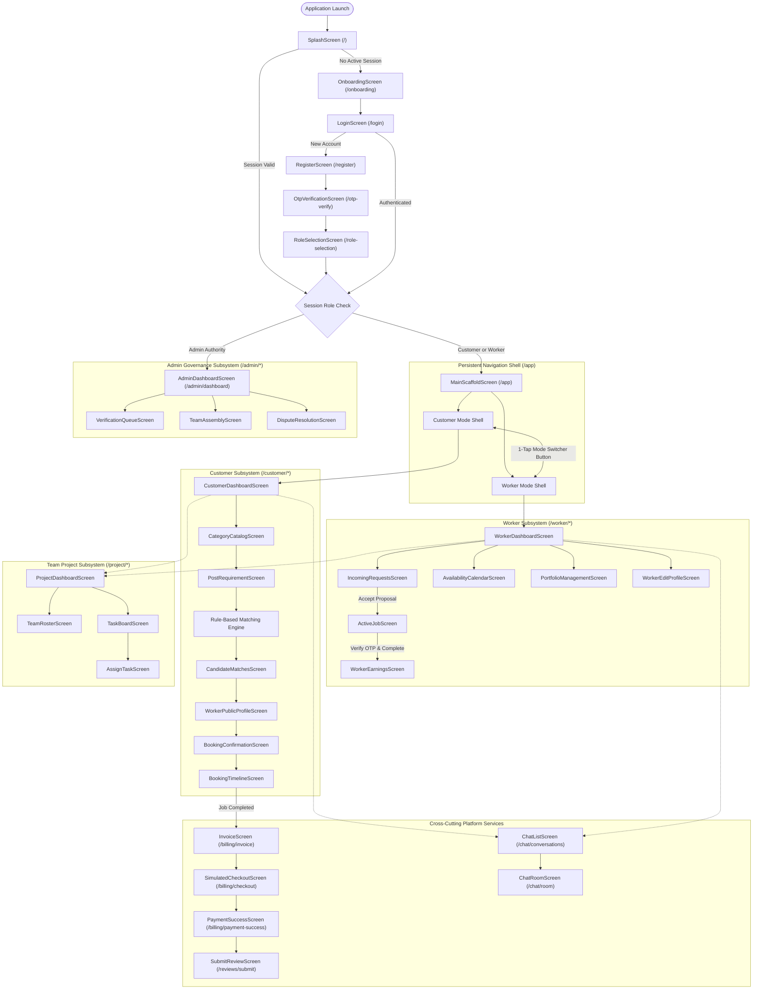
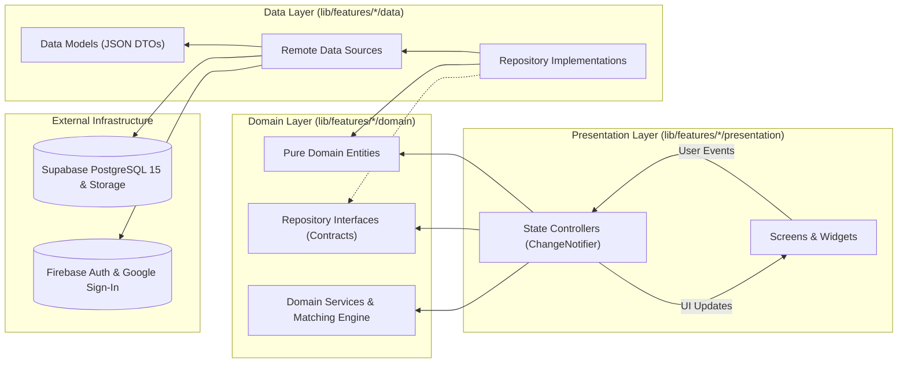
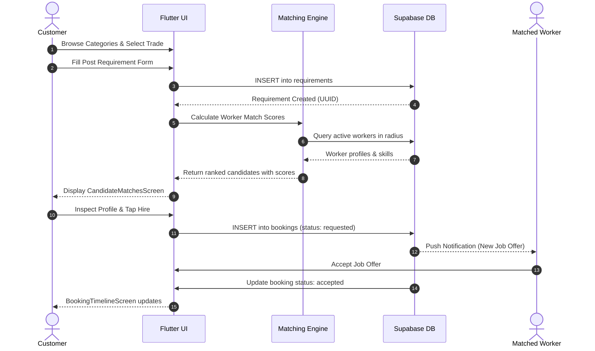
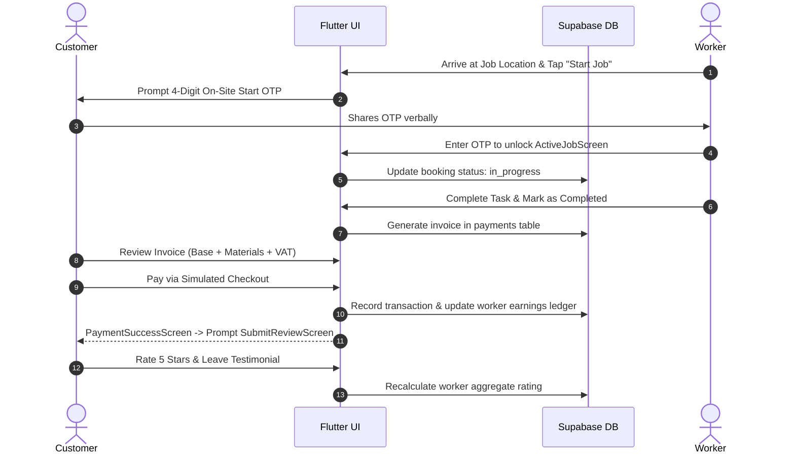
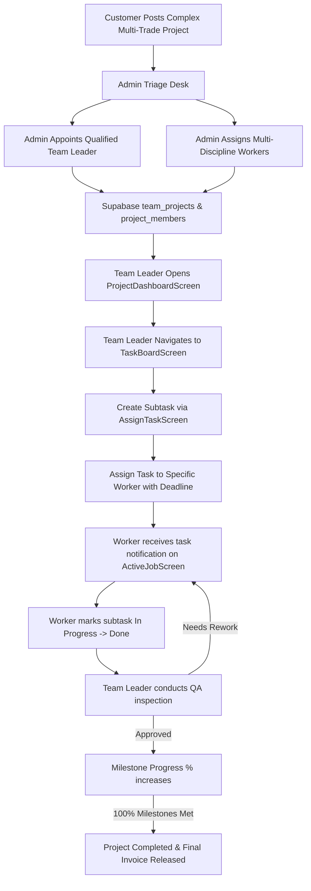

<p align="center">
  
</p>

<h1 align="center">SKAVIA — System Routing & Architecture Blueprint</h1>
<p align="center">
  <strong>Technical Specification: Navigation Topology, RBAC Guards & Directory Architecture</strong><br>
  <em>Production Standard • Version 1.0.0</em>
</p>

<p align="center">
  
  
  
  
  
</p>

---

## 1. Master System Navigation & Role-Switching Topology

The following comprehensive diagram illustrates the entire routing lifecycle of the SKAVIA platform—from application boot and session verification to dual-mode navigation and role-specific subsystems:



---

## 2. Clean Architecture Layer Dependency & Data Flow

SKAVIA is designed with strict adherence to **Domain-Driven Clean Architecture**, ensuring zero leakage of database drivers or framework code into pure business rules:



---

## 3. Directory Blueprint & Module Distribution

```text
lib/
├── firebase_options.dart                              # Automated Firebase configuration
├── main.dart                                          # Application bootstrapper & global zones
│
├── app/                                               # Global Application Orchestration
│   ├── app.dart                                       # MaterialApp, theme binding & route attachment
│   ├── bootstrap.dart                                 # Async service initialization (Supabase, Firebase)
│   ├── config/                                        # Environment & platform settings
│   │   ├── app_config.dart                            # API endpoints, Supabase credentials, storage keys
│   │   └── app_constants.dart                         # Universal platform SLAs, fee models, commission rules
│   ├── router/                                        # Central Navigation Engine
│   │   ├── app_router.dart                            # Central onGenerateRoute RouteFactory
│   │   ├── app_routes.dart                            # Immutable route constant names
│   │   └── route_guards.dart                          # Session integrity & Role-Based Access Control (RBAC)
│   └── theme/                                         # Universal Design System
│       ├── app_colors.dart                            # Color tokens (Brand Sapphire, Emerald, Slate)
│       ├── app_dimensions.dart                        # Padding, elevation, and radius tokens
│       ├── app_theme.dart                             # Complete light & dark ThemeData definitions
│       └── app_typography.dart                        # Font hierarchy (Inter & Poppins)
│
├── core/                                              # Reusable Low-Level Infrastructure
│   ├── constants/                                     # Asset references & static copy
│   │   ├── app_assets.dart                            # Logo, emblem, and illustration paths
│   │   └── app_strings.dart                           # Static UI labels, validation text, error copy
│   ├── errors/                                        # Standardized Failure Handlers
│   │   ├── app_exception.dart                         # Network, server, and storage exceptions
│   │   └── failure.dart                               # Domain-level failure representations
│   ├── extensions/                                    # Dart BuildContext & String Shortcuts
│   │   ├── context_extensions.dart                    # Fast access to Theme, MediaQuery, Navigator
│   │   └── string_extensions.dart                     # String sanitization & formatting utilities
│   ├── network/                                       # Connectivity Engine
│   │   └── network_info.dart                          # Real-time network reachability checker
│   ├── storage/                                       # Secure Local Cache
│   │   └── secure_storage_service.dart                # Encrypted storage for JWTs and active roles
│   └── utils/                                         # Pure Logic Helpers
│       ├── formatters.dart                            # Currency (BDT/৳), phone, and date formatters
│       ├── ui_feedback_helper.dart                    # Snackbars, toasts, and confirmation banners
│       └── validators.dart                            # Regex validators for NID, phone, and email
│
├── data/                                              # Shared Platform Database Drivers
│   ├── datasources/                                   # Universal Remote Clients
│   │   ├── remote_storage_datasource.dart             # Supabase Storage bucket operations
│   │   └── supabase_datasource.dart                   # Unified PostgREST query client wrapper
│   ├── services/                                      # Logging & Observability
│   │   └── logging_service.dart                       # Structured console & remote telemetry logger
│   └── tables/                                        # Database Relational Constants
│       └── database_tables.dart                       # 34 Postgres relational table string identifiers
│
├── shared/                                            # Universal Reusable UI Components
│   ├── dialogs/                                       # Modal Windows
│   │   ├── confirmation_dialog.dart                   # Standard destructive/approval dialog
│   │   └── error_dialog.dart                          # Modal error alert with retry trigger
│   ├── empty_states/                                  # Zero-Data Visual Feedback
│   │   └── empty_data_view.dart                       # Illustrated empty state view
│   ├── error_states/                                  # Full-Screen Failure Fallbacks
│   │   └── error_view.dart                            # Network or system breakdown fallback
│   ├── loaders/                                       # Loading States
│   │   ├── app_loading_indicator.dart                 # Custom branded circular loader
│   │   └── list_shimmer_skeleton.dart                 # Shimmer skeleton loader for list tiles
│   └── widgets/                                       # Atomic Reusable Widgets
│       ├── app_app_bar.dart                           # Standardized responsive AppBar
│       ├── app_button.dart                            # Universal primary, secondary, and outline buttons
│       ├── app_card.dart                              # Elevated surface cards with consistent borders
│       ├── app_text_field.dart                        # Custom TextFormField with validation & suffix icons
│       └── user_avatar.dart                           # Profile picture component with verified badge
│
└── features/                                          # Domain-Driven Feature Verticals (10 Modules)
    ├── authentication/                                # Identity & Verification (6 Screens)
    ├── navigation/                                    # Universal App Shell & Dynamic Nav (1 Screen)
    ├── customer/                                      # Customer Service Discovery & Booking (7 Screens)
    ├── worker/                                        # Worker Job Pipeline, Schedule & Earnings (7 Screens)
    ├── matching/                                      # Rule-Based Matching Scoring Engine
    ├── team_project/                                  # Multi-Worker Complex Project Coordination (4 Screens)
    ├── admin/                                         # Platform Governance, Approvals & Disputes (4 Screens)
    ├── billing/                                       # Financial Transparency & Checkout (3 Screens)
    ├── reviews/                                       # Dual-Sided Quality Rating & Reputation (2 Screens)
    └── chat/                                          # Realtime Chat & Message Attachments (2 Screens)
```

---

## 4. Master Route Registry Table (36 Platform Screens)

The table below catalogs every screen across the SKAVIA application along with its designated route identifier, URI path, widget class, file path, access permissions, and required arguments:

| # | Route Identifier Constant (`AppRoutes.*`) | URI Path (`String`) | Target Screen Class | Source File Location | Role Access | Required Arguments / Payload | Guard Rules & Functional Scope |
|:---:|:---|:---|:---|:---|:---|:---|:---|
| **1** | `splash` | `/` | `SplashScreen` | `lib/features/authentication/presentation/screens/splash_screen.dart` | Public | None | Verifies active session token. Routes to `/onboarding` if fresh, or `/app` if active. |
| **2** | `onboarding` | `/onboarding` | `OnboardingScreen` | `lib/features/authentication/presentation/screens/onboarding_screen.dart` | Public | None | Introduction carousel. Dismissal saves flag in secure storage and pushes `/login`. |
| **3** | `login` | `/login` | `LoginScreen` | `lib/features/authentication/presentation/screens/login_screen.dart` | Public | None | Authenticates via Email/Password or Google Sign-In. Redirects to previous intent or `/app`. |
| **4** | `register` | `/register` | `RegisterScreen` | `lib/features/authentication/presentation/screens/register_screen.dart` | Public | None | Collects user profile details and requested account intent. Transitions to `/otp-verify`. |
| **5** | `otpVerify` | `/otp-verify` | `OtpVerificationScreen` | `lib/features/authentication/presentation/screens/otp_verification_screen.dart` | Public | `phone` (`String`), `verificationId` (`String`) | Validates 6-digit SMS OTP against Firebase Auth before creating Supabase user profile. |
| **6** | `roleSelection` | `/role-selection` | `RoleSelectionScreen` | `lib/features/authentication/presentation/screens/role_selection_screen.dart` | Authenticated | None | Initial post-registration choice to configure a Customer profile or apply as a Worker. |
| **7** | `mainAppShell` | `/app` | `MainScaffoldScreen` | `lib/features/navigation/presentation/screens/main_scaffold_screen.dart` | Authenticated | Optional: `initialIndex` (`int`) | Persistent shell holding dynamic role navigation and the 1-tap Mode Switcher floating button. |
| **8** | `customerDashboard` | `/customer/dashboard` | `CustomerDashboardScreen` | `lib/features/customer/presentation/screens/customer_dashboard_screen.dart` | Customer | None | Customer home feed displaying quick services, active booking statuses, and top workers. |
| **9** | `categoryCatalog` | `/customer/categories` | `CategoryCatalogScreen` | `lib/features/customer/presentation/screens/category_catalog_screen.dart` | Customer | Optional: `parentId` (`String?`) | Visual catalog of available trades, subcategories, standard rates, and required tools. |
| **10** | `postRequirement` | `/customer/post-requirement` | `PostRequirementScreen` | `lib/features/customer/presentation/screens/post_requirement_screen.dart` | Customer | Optional: `preselectedCategoryId` (`String?`) | Multi-step form capturing job scope, location coordinates, photos, budget, and urgency. |
| **11** | `candidateMatches` | `/customer/matches` | `CandidateMatchesScreen` | `lib/features/customer/presentation/screens/candidate_matches_screen.dart` | Customer | `requirementId` (`String`) | Ranked worker list generated by the rule-based scoring engine with percentage badges. |
| **12** | `workerPublicProfile` | `/customer/worker-profile` | `WorkerPublicProfileScreen` | `lib/features/customer/presentation/screens/worker_public_profile_screen.dart` | Customer, Admin | `workerId` (`String`) | Public view of worker credentials, badges, portfolio gallery, and past customer reviews. |
| **13** | `bookingConfirmation` | `/customer/booking-confirm` | `BookingConfirmationScreen` | `lib/features/customer/presentation/screens/booking_confirmation_screen.dart` | Customer | `bookingPayload` (`Map<String, dynamic>`) | Pre-booking summary with estimated cost, scheduled time, cancellation policy, and confirm button. |
| **14** | `bookingTimeline` | `/customer/booking-timeline` | `BookingTimelineScreen` | `lib/features/customer/presentation/screens/booking_timeline_screen.dart` | Customer, Worker | `bookingId` (`String`) | Real-time status tracker (Requested → Accepted → En Route → In Progress → Completed). |
| **15** | `workerDashboard` | `/worker/dashboard` | `WorkerDashboardScreen` | `lib/features/worker/presentation/screens/worker_dashboard_screen.dart` | Worker | None | Provider home feed with availability status switch, incoming requests count, and today's earnings. |
| **16** | `incomingRequests` | `/worker/incoming-requests` | `IncomingRequestsScreen` | `lib/features/worker/presentation/screens/incoming_requests_screen.dart` | Worker | None | Real-time queue of matched job opportunities with accept/decline action triggers. |
| **17** | `activeJob` | `/worker/active-job` | `ActiveJobScreen` | `lib/features/worker/presentation/screens/active_job_screen.dart` | Worker | `jobId` (`String`) | On-site execution screen with OTP job start verification, material notes, and completion trigger. |
| **18** | `availabilityCalendar` | `/worker/calendar` | `AvailabilityCalendarScreen` | `lib/features/worker/presentation/screens/availability_calendar_screen.dart` | Worker | None | Interactive calendar for defining work shifts, days off, and emergency call availability. |
| **19** | `portfolioManagement` | `/worker/portfolio` | `PortfolioManagementScreen` | `lib/features/worker/presentation/screens/portfolio_management_screen.dart` | Worker | None | Media upload screen for job photos and trade certificates directly to Supabase Storage. |
| **20** | `workerEarnings` | `/worker/earnings` | `WorkerEarningsScreen` | `lib/features/worker/presentation/screens/worker_earnings_screen.dart` | Worker | None | Detailed earnings metrics, commission deduction breakdown, and bank cashout requests. |
| **21** | `workerEditProfile` | `/worker/edit-profile` | `WorkerEditProfileScreen` | `lib/features/worker/presentation/screens/worker_edit_profile_screen.dart` | Worker | None | Updates professional bio, hourly/flat rates, service radius (km), and trade category tags. |
| **22** | `projectDashboard` | `/project/dashboard` | `ProjectDashboardScreen` | `lib/features/team_project/presentation/screens/project_dashboard_screen.dart` | Team Leader, Customer | `projectId` (`String`) | Executive project overview tracking milestone health, aggregate budget, and overall progress. |
| **23** | `teamRoster` | `/project/team-roster` | `TeamRosterScreen` | `lib/features/team_project/presentation/screens/team_roster_screen.dart` | Team Leader, Admin | `projectId` (`String`) | List of multi-skilled workers assigned to the project with contact options and roles. |
| **24** | `taskBoard` | `/project/tasks` | `TaskBoardScreen` | `lib/features/team_project/presentation/screens/task_board_screen.dart` | Team Leader, Worker | `projectId` (`String`) | Agile Kanban-style subtask view (To Do, In Progress, In Review, Done) for assigned tasks. |
| **25** | `assignTask` | `/project/assign-task` | `AssignTaskScreen` | `lib/features/team_project/presentation/screens/assign_task_screen.dart` | Team Leader | `projectId` (`String`), Optional: `taskId` | Form to create a project subtask, assign an eligible team member, and define deadlines. |
| **26** | `adminDashboard` | `/admin/dashboard` | `AdminDashboardScreen` | `lib/features/admin/presentation/screens/admin_dashboard_screen.dart` | Admin | None | Executive operations console showing active users, daily GMV, pending disputes, and logs. |
| **27** | `teamAssembly` | `/admin/team-assembly` | `TeamAssemblyScreen` | `lib/features/admin/presentation/screens/team_assembly_screen.dart` | Admin | `requirementId` (`String`) | Administrative workspace to assemble multi-worker teams and appoint a Team Leader. |
| **28** | `verificationQueue` | `/admin/verification-queue` | `VerificationQueueScreen` | `lib/features/admin/presentation/screens/verification_queue_screen.dart` | Admin | None | Verification inspection desk to approve or reject submitted National IDs and certificates. |
| **29** | `disputeResolution` | `/admin/disputes` | `DisputeResolutionScreen` | `lib/features/admin/presentation/screens/dispute_resolution_screen.dart` | Admin | None | Arbitration workbench to review customer claims, inspect chat logs, and issue refunds. |
| **30** | `invoice` | `/billing/invoice` | `InvoiceScreen` | `lib/features/billing/presentation/screens/invoice_screen.dart` | Authenticated | `bookingId` (`String`) | Itemized financial invoice reflecting base charge, material expenses, discount, and VAT. |
| **31** | `simulatedCheckout` | `/billing/checkout` | `SimulatedCheckoutScreen` | `lib/features/billing/presentation/screens/simulated_checkout_screen.dart` | Customer | `invoiceId` (`String`), `amount` (`double`) | Simulated sandbox gateway supporting bKash, Nagad, and Credit/Debit card settlement. |
| **32** | `paymentSuccess` | `/billing/payment-success` | `PaymentSuccessScreen` | `lib/features/billing/presentation/screens/payment_success_screen.dart` | Customer | `transactionId` (`String`) | Payment celebration view displaying transaction reference number and receipt download. |
| **33** | `submitReview` | `/reviews/submit` | `SubmitReviewScreen` | `lib/features/reviews/presentation/screens/submit_review_screen.dart` | Customer | `bookingId` (`String`), `workerId` (`String`) | Multi-criteria 5-star evaluation (punctuality, quality, behavior) with photo feedback. |
| **34** | `workerReputation` | `/reviews/worker-reputation` | `WorkerReputationScreen` | `lib/features/reviews/presentation/screens/worker_reputation_screen.dart` | Worker, Customer | `workerId` (`String`) | Comprehensive rating analytics, badge progression, and verified customer testimonials. |
| **35** | `chatList` | `/chat/conversations` | `ChatListScreen` | `lib/features/chat/presentation/screens/chat_list_screen.dart` | Authenticated | None | Active messaging inbox listing customer, worker, and team leader discussion channels. |
| **36** | `chatRoom` | `/chat/room` | `ChatRoomScreen` | `lib/features/chat/presentation/screens/chat_room_screen.dart` | Authenticated | `channelId` (`String`), `recipientName` (`String`) | Real-time chat dialogue screen backed by Supabase Realtime with image attachment support. |

---

## 5. Detailed Feature Lifecycle Diagrams

### 5.1 Customer Service Discovery & Direct Booking Flow


### 5.2 Worker Execution, Job Verification & Settlement Flow


### 5.3 Complex Team Project Coordination & Subtask Delegation Flow


---

## 6. Route Guard & Interceptor Implementation Standards

All route transitions orchestrated via `AppRouter.onGenerateRoute` must pass through the `RouteGuards.verifyAccess` gate before returning the corresponding `MaterialPageRoute`.

### 6.1 Route Guard Interception Standard
```dart
class RouteGuards {
  static const List<String> publicRoutes = [
    AppRoutes.splash,
    AppRoutes.onboarding,
    AppRoutes.login,
    AppRoutes.register,
    AppRoutes.otpVerify,
  ];

  static MaterialPageRoute<dynamic> verifyAccess({
    required RouteSettings settings,
    required Widget targetScreen,
    required UserSessionState session,
  }) {
    // 1. Allow public routes without session check
    if (publicRoutes.contains(settings.name)) {
      return MaterialPageRoute(builder: (_) => targetScreen, settings: settings);
    }

    // 2. Intercept unauthenticated users
    if (!session.isAuthenticated) {
      return MaterialPageRoute(
        builder: (_) => const LoginScreen(),
        settings: const RouteSettings(name: AppRoutes.login),
      );
    }

    // 3. Admin Authorization Guard
    if (settings.name?.startsWith('/admin') == true && session.activeRole != UserRole.admin) {
      return MaterialPageRoute(
        builder: (_) => const AccessDeniedScreen(),
        settings: settings,
      );
    }

    // 4. Return authorized screen
    return MaterialPageRoute(builder: (_) => targetScreen, settings: settings);
  }
}
```

---

## 7. Developer Rules of Engagement

1. **No Hardcoded Route Literals:** Never write strings like `'/customer/dashboard'`. Always import and use `AppRoutes.customerDashboard`.
2. **Strict Screen Argument Typing:** Arguments passed in `Navigator.pushNamed(context, route, arguments: args)` must use dedicated immutable DTO classes or strongly-typed maps.
3. **Pure Presentational Screens:** Screen classes are purely presentational and must never query Supabase or Firebase directly; all business actions are routed through their respective `ChangeNotifier` controllers.
4. **Zero-Lint Standard:** Always ensure `flutter analyze` runs with **0 errors and 0 warnings** whenever registering a new route or modifying an existing screen.
